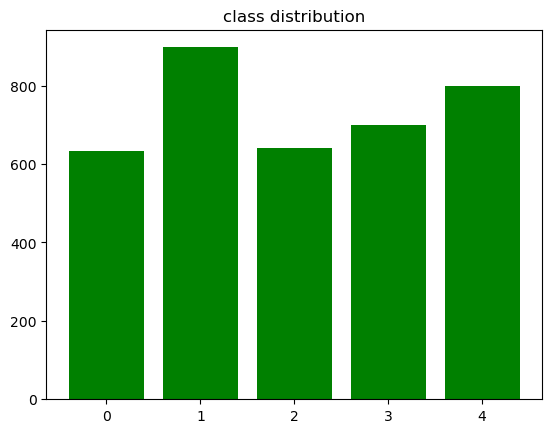
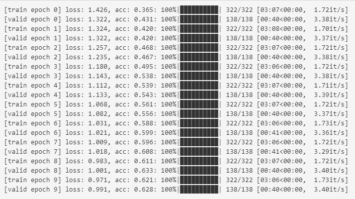
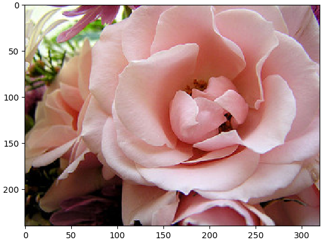
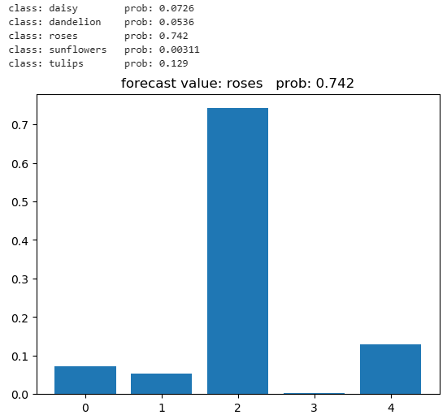

# My Vision Transformer

Github :[https://github.com/RWLinno/ViT-Model-based-Medical-Image-Assisted-Diagnostic-System](https://github.com/RWLinno/ViT-Model-based-Medical-Image-Assisted-Diagnostic-System)


### Environments

You can replicate the environment I was experimenting in with the following commands:

1. Creating a Virtual Environment

```
conda create -n ViT python==3.7.16
conda activate ViT
```

2. Quickly install the dependencies with the following command (or torch is all your need)

```
pip3 install -r requirements.txt
```

3. Download the **flower_photos dataset**, or you can just use the code in train.ipynb to unzip `flower_photos.tar`

```
gdown https://drive.google.com/uc?id=1J5UryTNkXDSEpbmPoMH3Hry9iRXwaSES
```

4. You can optionally download my pre-trained model and put it into the `models` folder

```
# ViT_pre_train_5_epochs.pth
gdown https://drive.google.com/uc?id=1ejwfSjadBnxJy2-Q5sZUbJFzt6F3jz_y

# ViT_pre_train_10_epochs.pth
gdown https://drive.google.com/uc?id=1cRpmA3fGrHx_mOIdf9ZFBPBW6dIubKhx

# ViT_pre_train_10_epochs.pth
gdown https://drive.google.com/uc?id=19kc-YlXcjNzkBQ8iJkPX3OklSawt_myS
```


### Introduction

Our project files are structured as follows

```
MyViT/
│───README.md
└───data/
│   │───flower_photos/
│   │   │   daisy/
│   │   │   dandelion/
│   │   │   roses/
│   │   │   sunflowers/
│   │   │   tulips/
│   │   ...
│   └───samples/
└───models/
└───pic/
│   Mydataset.py
│   ViT.py
│   utils.py
│   train.ipynb
│   prediction.ipynb
│   flower_photos.tar
│   ...
```

- We've only trained on the **flower_photos** dataset so far, but I'd like to train the medical dataset when I have time!

  

### Training

- open your IDEs to run **train.ipynb** to traning a model based on your dataset
  - I recommend jupyter lab or vscode with the extension 'jupyter'
  - In the code you can adjust the following parameters yourself
    - dataset_path	
    - batch_size
    - epoch_num
    - learning_rate(relatively unimportant because we adaptively update the learning rate)
- Here's a preview of some of our training





### Prediction

**train.ipynb** provides an example of predicting a single image using a pre-trained model, please modify it for your own dataset!






### Acknowledgement

##### Contributors

- [RWLinno](https://github.com/RWLinno)
- [Aritst](https://github.com/IcecreamArtist)

##### References

- [WZMIAOMIAO](https://github.com/WZMIAOMIAO/deep-learning-for-image-processing/tree/master)
- https://www.sohu.com/a/677833784_121119001
- https://zhuanlan.zhihu.com/p/385406085
- https://blog.csdn.net/weixin_44791964/article/details/122637701